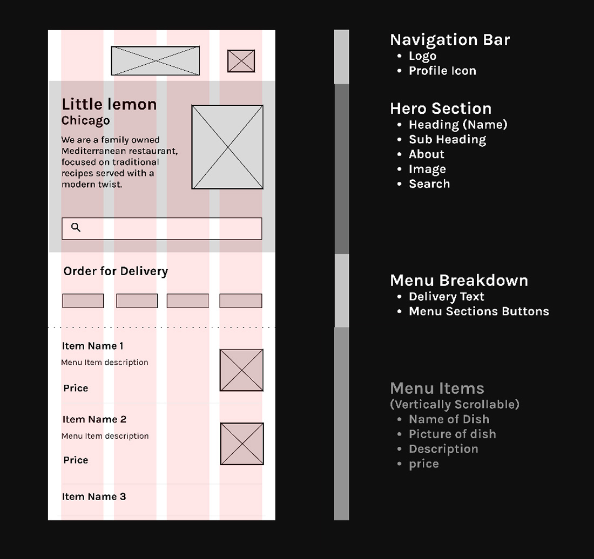
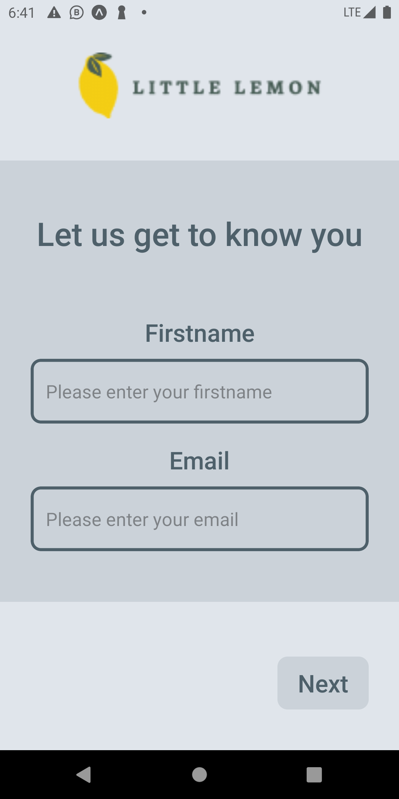
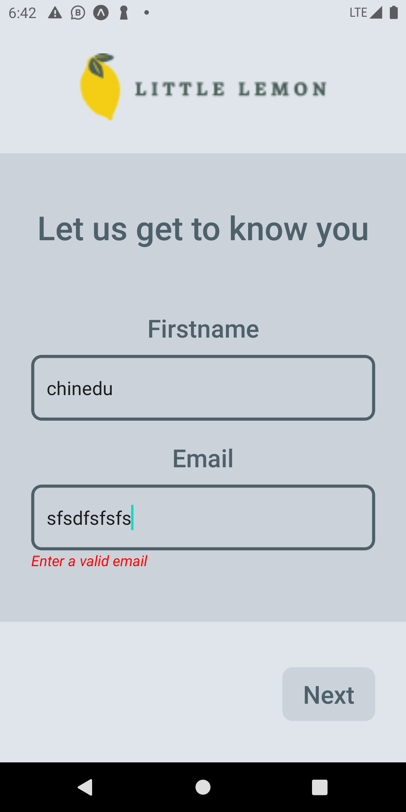
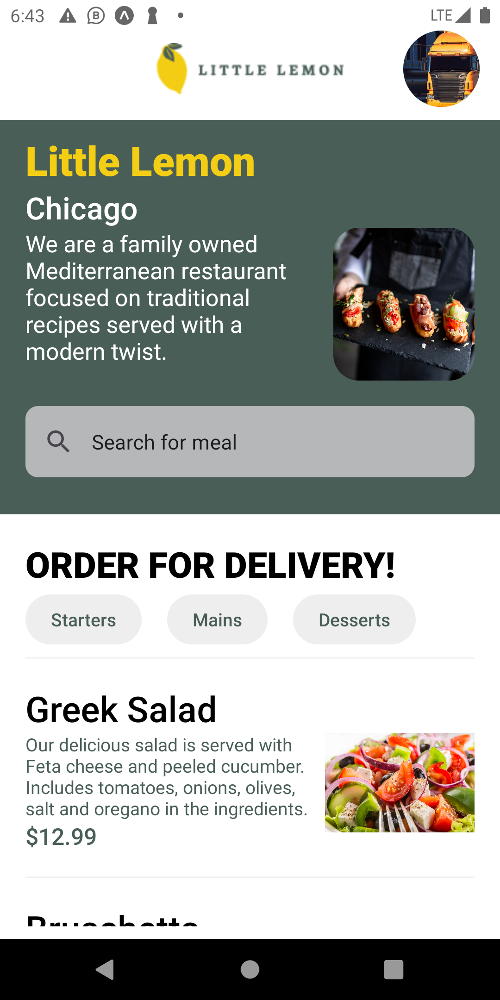
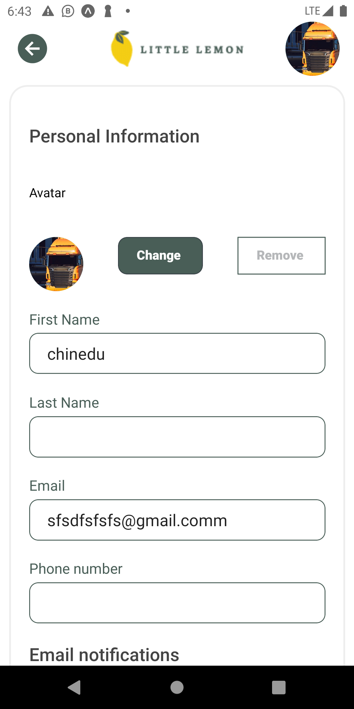

# Meta React Native Capstone Project

## Initial wireframe design

## Step 1

### Onboarding Screen

1. Onboaring screen before validation
   
2. Onboarding during validation
   

### Home Screen

Home screen allow users to filter menu by category and search.

### Profile Screen

Screen that manages the users profile

